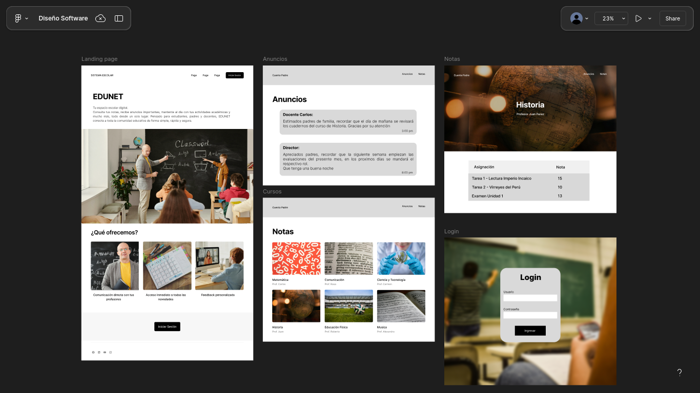

# Sistema-Academico EDUNET

## Índice

- [Sistema-Academico EDUNET](#sistema-academico-edunet)
  - [Índice](#índice)
  - [Integrantes](#integrantes)
  - [Propósito](#propósito)
    - [Funcionalidades de Alto Nivel](#funcionalidades-de-alto-nivel)
    - [Diagrama de Casos de Uso UML](#diagrama-de-casos-de-uso-uml)
    - [Prototipo (GUI)](#prototipo-gui)
    - [Arquitectura: DDD + Clean Architecture](#arquitectura-ddd--clean-architecture)
      - [Estructura de Carpetas](#estructura-de-carpetas)
      - [Principios aplicados](#principios-aplicados)
    - [Principales Entidades](#principales-entidades)
    - [Módulos](#módulos)
  - [DTOs](#dtos)
  - [Requisitos](#requisitos)

- [Módulos y principales servicios REST](#módulos-y-principales-servicios-rest)
- [Gestion de Configuracion](#gestión-de-configuración)
  - [Gestion de cambios](#gestión-de-cambios)
  - [Pipeline CI/CD](#pipeline-cicd)
    - [1. Construccion Automatica](#1-construcción-automática)
    - [2. Analisis Estatico](#2-análisis-estático)
    - [3. Pruebas Unitarias](#3-pruebas-unitarias)
    - [4. Pruebas Funcionales](#4-pruebas-funcionales)
    - [5. Pruebasd de rendimiento](#5-pruebas-de-rendimiento)
    - [6. Pruebas de Seguridad](#6-pruebas-de-seguridad)
- [Practicas de desarrollo de software](#practicas-de-desarrollo-de-software)
  - [Reporte SonarLint](#reporte-sonarlint)
    - [1. Literales de Cadena Duplicadas](#1-literales-de-cadena-duplicadas)
    - [2. Clase/Funcion/Metodo no cumple la convención de nombres (python:S101)](#2-clasefuncionmetodo-no-cumple-la-convención-de-nombres-pythons101)
    - [3. MySQL database passwords should not be disclosed (secrets:S6697)](#3-mysql-database-passwords-should-not-be-disclosed-secretss6697)
    - [4. Unused local variables should be removed (python:S1481)](#4-unused-local-variables-should-be-removed-pythons1481)
  - [Estilos de programacion](#estilos-de-programacion)
    - [coobook](#coobook)
    - [Adversity](#adversity)
    - [Persistent-Tables (Tablas Persistentes)](#persistent-tables-tablas-persistentes)
    - [Pipeline (Tubería de Procesamiento)](#pipeline-tubería-de-procesamiento)
  - [Convenciones de codificacion PEP8 para python](#convenciones-de-codificacion-pep8-para-python)
    - [Clases (PascalCase)](#clases-pascalcase)
    - [Funciones y Métodos (snake\_case)](#funciones-y-métodos-snake_case)
    - [Variables (snake\_case)](#variables-snake_case)
    - [Constantes (UPPER\_SNAKE\_CASE)](#constantes-upper_snake_case)
  - [Codificacion limpia (Clean Code) y Principios SOLID](#codificacion-limpia-clean-code-y-principios-solid)
    - [Variables](#variables)
      - [Ejemplo:](#ejemplo)
    - [Funciones](#funciones)
      - [Ejemplo:](#ejemplo-1)
    - [Clases](#clases)
      - [Ejemplo de clase con responsabilidad definida:](#ejemplo-de-clase-con-responsabilidad-definida)
      - [I. Single Responsibility Principle (SRP)](#i-single-responsibility-principle-srp)
        - [Ejemplo:](#ejemplo-2)
      - [II. Open/Closed Principle (OCP)](#ii-openclosed-principle-ocp)
        - [Ejemplo:](#ejemplo-3)
      - [III. Liskov Substitution Principle (LSP)](#iii-liskov-substitution-principle-lsp)
        - [Ejemplo:](#ejemplo-4)
      - [IV. Interface Segregation Principle (ISP)](#iv-interface-segregation-principle-isp)
        - [Ejemplo:](#ejemplo-5)
      - [V. Dependency Inversion Principle (DIP)](#v-dependency-inversion-principle-dip)
        - [Ejemplo:](#ejemplo-6)
    - [Don't Repeat Yourself (DRY)](#dont-repeat-yourself-dry)
      - [Ejemplo:](#ejemplo-7)
    - [Comentarios útiles y mínimos](#comentarios-útiles-y-mínimos)
    - [Ejemplo:](#ejemplo-8)


## Integrantes
- ALEXANDER HUAYHUA PEREZ
- JAFET POCO CHIRE
- BERLY DUEÑAS MANDAMIENTOS
- FERNANDO A. SUCA QUISPE
- RONALD VENTURA VENERO


## Propósito

**EDUNET** es un sistema académico digital diseñado para conectar a estudiantes, padres y docentes en una sola plataforma. Permite la gestión de notas, anuncios y comunicación eficiente dentro de la comunidad educativa, facilitando el acceso seguro y centralizado a la información escolar.

---

### Funcionalidades de Alto Nivel

- Consulta de notas y calificaciones por estudiantes y padres.
- Publicación de anuncios por parte de administradores.
- Gestión de usuarios (padres, profesores, administradores).
- Visualización de actividades académicas y reportes.

### Diagrama de Casos de Uso UML


### Prototipo (GUI)

La interfaz principal incluye:
- Página de inicio con información general.
- Barra de navegación para acceso a funcionalidades.
- Secciones para anuncios, notas, reportes y gestión de usuarios.

[Prototipo GUI](https://www.figma.com/design/mePETDXZAzFnH5TMuKuZg2/Dise%C3%B1o-Software?node-id=0-1&p=f&t=159E8ZY7anSn5hm4-0)



---

### Arquitectura: DDD + Clean Architecture

#### Estructura de Carpetas
```
app/
│
├── routes/
│   ├── admin\_routes.py
│   ├── announcement\_routes.py
│   ├── auth\_routes.py
│   └── … (otros endpoints)
│
├── application/
│   ├── admin\_controller.py
│   ├── announcement\_controller.py
│   ├── auth\_controller.py
│   └── … (otros controllers)
│
├── domain/
│   ├── entities.py
│   └── services/
│       ├── auth\_service.py
│       ├── announcement\_service.py
│       ├── course\_service.py
│       └── … (otros servicios)
│
└── infrastructure/
├── database.py
└── repository/
├── models.py
├── mapper.py
└── repository.py
```

#### Principios aplicados

- **Domain‑Driven Design (DDD)**  
  ­ ­­– Entidades y Value Objects en `domain/entities.py`.  
  ­ ­­– Servicios de Dominio en `domain/services/` encapsulan reglas de negocio.  
  ­ ­­– Repositorios (interfaces) definidos en el dominio e implementados en `infrastructure/repository`.

- **Clean Architecture**  
  ­ ­­– Las dependencias apuntan hacia adentro:  
  ­ ­­ ­ ­ • `html` <--> `routes` <--> `application` <--> `domain` <--> `infrastructure` <--> `MySQL`  
  ­ ­­– Capa de presentación (Flask) separada de la lógica, que reside en controllers y servicios.  
  ­ ­­– Infraestructura (ORM, base de datos) aislada tras repositorios y mapeadores.

### Principales Entidades

- **Usuario**: Base para Estudiante, Profesor, Padre, Administrador.
- **Curso**: Relaciona estudiantes y profesores.
- **Anuncio**: Publicado por profesores/administradores.
- **Calificación**: Asociada a estudiantes y cursos.
- **Asistencia**: Registro de asistencia por curso y estudiante.

### Módulos

- `domain/entities`: Entidades y repositorios del dominio.
- `infrastructure/repository`: Implementaciones de acceso a datos.
- `domain/services`: Lógica de negocio y servicios de aplicación.
- `application`: Controladores.
- `routes`: Endpoints web.
- `templates`: Plantillas HTML para la GUI.
- `config`: Configuración de la aplicación.

### Módulos y principales servicios REST

#### Auth (Autenticación)
**Propósito:** Gestionar la autenticación de usuarios, incluyendo el inicio de sesión (creación de sesión), registro de nuevas cuentas y cierre de sesión.

**Operaciones disponibles:**
- `POST /api/auth/login`: Autentica a un usuario mediante credenciales e inicia una sesión basada en cookies.
- `POST /api/auth/register`: Crea una nueva cuenta de usuario (requiere activación posterior o flujo separado).
- `POST /api/auth/logout`: Limpia la sesión actual del usuario.

**Parámetros clave:**
- Login (Body): `email` y `password` son obligatorios.
- Register (Body): `full_name`, `email`, `password` y `confirm_password` son obligatorios.

**Modelos Clave:**
- `AuthLoginRequest`: Esquema para el envío de credenciales de inicio de sesión.
- `AuthUser`: Representación del usuario autenticado devuelto tras un login o registro exitoso (incluye rol e ID).

---

#### Admin (Administración)
**Propósito:** Proveer herramientas para que los administradores gestionen usuarios y sus roles dentro del sistema.

**Operaciones disponibles:**
- `GET /admin/users`: Retorna la lista completa de usuarios para los paneles de administración.
- `POST /admin/users/{user_id}`: Actualiza el rol de un usuario específico.

**Parámetros clave:**
- Update Role (Path): `user_id` (Entero, ID del usuario a modificar).
- Update Role (Body): `role` (Entero, código del nuevo rol a asignar).

**Modelos Clave:**
- `User`: Objeto completo de usuario incluyendo ID, nombre, correo y código de rol.
- `UpdateUserRoleRequest`: Cuerpo de la petición para cambiar el rol de un usuario.

---

#### Announcements (Anuncios)
**Propósito:** Manejar la publicación y visualización de anuncios, separando los públicos de los privados según la sesión del usuario.

**Operaciones disponibles:**
- `GET /api/anuncios`: Obtiene anuncios públicos (para todos) y privados (filtrados por usuario autenticado).
- `POST /api/anuncios/admin`: Permite a un administrador crear un anuncio nuevo.

**Parámetros clave:**
- Create (Body): `title` y `content` son obligatorios. Opcionales: `is_private` y `course_id`.

**Modelos Clave:**
- `Announcement`: Estructura del anuncio que incluye título, contenido, visibilidad y fecha de creación.
- `AnnouncementCreateRequest`: Datos requeridos para dar de alta un anuncio.

---

#### Grades (Notas - Vista Padres)
**Propósito:** Permitir a los usuarios con rol de "Padre" consultar las calificaciones de sus hijos asociados.

**Operaciones disponibles:**
- `GET /parent_query_grades`: Retorna las notas de todos los hijos del usuario autenticado (requiere rol de padre).

**Parámetros clave:**
- No requiere parámetros de entrada explícitos (depende de la sesión del usuario).

**Modelos Clave:**
- `ParentGradesResponse`: Respuesta que agrupa la lista de estudiantes (hijos) con sus respectivas calificaciones.
- `StudentWithGrades`: Objeto que vincula el nombre de un estudiante con su lista de materias y notas.

---

#### Courses (Cursos)
**Propósito:** Gestión administrativa de cursos (creación y listado) y visualización de métricas de cursos para profesores.

**Operaciones disponibles:**
- `GET /admin/courses`: Lista todos los cursos existentes (sólo admin).
- `GET /admin/courses/create`: Lista los profesores disponibles para asignar a un nuevo curso.
- `POST /admin/courses/create`: Crea un nuevo curso y le asigna un profesor.
- `GET /cursos`: Retorna los cursos asignados al profesor autenticado con métricas (promedios, conteo de alumnos).

**Parámetros clave:**
- Create (Body): `name` (Nombre del curso) y `professor_id` (ID del docente) son obligatorios.

**Modelos Clave:**
- `Course`: Representación básica de un curso (ID, nombre, ID del profesor).
- `CourseMetrics`: Datos del curso enriquecidos para el dashboard del profesor (incluye `average_score` y `student_count`).

---

#### Qualifications (Calificaciones)
**Propósito:** Facilitar al profesor el proceso de calificar a los estudiantes, listar alumnos por curso y registrar notas.

**Operaciones disponibles:**
- `GET /calificar`: Obtiene la lista de cursos asignados al profesor para proceder a calificar.
- `POST /calificar`: Registra una nota para un estudiante en un curso específico.
- `GET /api/students-by-course`: Lista los estudiantes inscritos en un curso específico.

**Parámetros clave:**
- Create Qualification (Body): `student_id`, `course_id` y `score` son obligatorios.
- List Students (Query): `course_id` es obligatorio para filtrar los alumnos.

**Modelos Clave:**
- `QualificationCreateRequest`: Payload necesario para enviar una nota.
- `StudentBasic`: Información mínima del estudiante (ID y nombre) para listados de selección.

---

#### Reports (Reportes)
**Propósito:** Generación de reportes detallados de calificaciones por curso para los profesores.

**Operaciones disponibles:**
- `GET /reporte/formulario`: Obtiene los cursos del profesor disponibles para generar reportes.
- `GET /reporte/curso`: Genera el reporte de notas detallado para un curso específico.

**Parámetros clave:**
- Get Report (Query): `course_id` es obligatorio para identificar el curso a reportar.

**Modelos Clave:**
- `CourseReportResponse`: Respuesta que contiene el nombre del curso y la lista de notas de los estudiantes.
- `StudentGrade`: Detalle de la nota de un estudiante específico dentro del reporte.

---

#### Users (Usuarios)
**Propósito:** Proporcionar acceso a la información del perfil del usuario actualmente autenticado.

**Operaciones disponibles:**
- `GET /user/profile`: Retorna los datos básicos de sesión del usuario.

**Parámetros clave:**
- No requiere parámetros (usa la sesión activa).

**Modelos Clave:**
- `UserProfileResponse`: Datos del perfil incluyendo nombre, email, rol y permisos.

---

## DTOs 
```python
class UserDTO(db.Model):
    user_id = Column(Integer, primary_key=True)
    email   = Column(String, unique=True)
    role    = Column(Integer)

class User:
    def __init__(self, user_id, email, role):
        self.user_id = user_id
        self.email   = email
        self.role    = role

class UserMapper:
    @staticmethod
    def to_domain(dto: UserDTO) -> User:
        return User(dto.user_id, dto.email, dto.role)

    @staticmethod
    def to_dto(domain: User) -> UserDTO:
        return UserDTO(user_id=domain.user_id, email=domain.email, role=domain.role)

class BaseRepository:
    dto: Type
    mapper: Type
    def add(self, domain_obj): ...
    def get(self, id): ...

class UserRepository(BaseRepository):
    dto    = UserDTO
    mapper = UserMapper
```

---


- **app/domain/services**: Servicios de aplicación (notificaciones, reportes).
- **app/domain/entities**: Entidades y contratos del dominio.
- **infrastructure/repository**: Implementaciones de acceso a datos.
- **app/application**: Controladores Flask.
- **templates**: Vistas HTML (Jinja2).

---

## Requisitos

- Python 3.12+
- Flask
- SQLAlchemy
- MySQL Connector
- dotenv
- Base de datos relacional MySQL

Instalar dependencias:
```bash
pip install -r requirements.txt
```
## Gestión de Configuración
### Gestión de cambios.
Se utilizo Github Projects para manejar el desarrollo de issues y las prácticas asociadas al proyecto. Seguimos un modelo de branching **Gitflow**.


### Pipeline CI/CD


#### 1. Construcción Automática.
El proyecto compila el frontend en Vue, mientras el backend se hace con python. La gestión de las  dependencias del proyecto está a cargo de npm (frontend) y poetry (backend). Finalmente, el proyecto se empaqueta usando docker.


#### 2. Análisis estático


#### 3. Pruebas unitarias


#### 4. Pruebas funcionales


#### 5. Pruebas de rendimiento


#### 6. Pruebas de seguridad


# Practicas de desarrollo de software

## Reporte SonarLint

### 1. Literales de Cadena Duplicadas  
**Regla:** `python:S1192`  
**Descripción:** String literals should not be duplicated  
**Ubicación:** Múltiples archivos (por ejemplo, `repository.py`, `controller.py`)  
**Tipo:** Code Smell

Se encontraron múltiples ocurrencias de literales como `'courses.course_id'` y `'users.user_id'`.  
Esto puede dificultar el mantenimiento y la refactorización del código.

**Solución:**

Definir constantes con nombres descriptivos:
```
COURSE_ID = 'courses.course_id'
USER_ID = 'users.user_id'
```

### 2. Clase/Funcion/Metodo no cumple la convención de nombres (python:S101)

**Regla:** `python:S101`  
**Descripción:** Los nombres de las clases deben coincidir con una expresión regular configurada (por defecto: `^_?([A-Z_][a-zA-Z0-9]*|[a-z_][a-z0-9_]*)$`).  
**Ubicación:** Clase `Anuncio_rep`  
**Tipo:** Code Smell

El nombre `Anuncio_rep` no coincide con la convención recomendada (CapWords o snake_case para clases utilizadas como callables).  

**Solución:**

Renombrar la clase respetando “PascalCase”, por ejemplo:

```python
class AnnouncementRepository:
    ...
```

De la misma forma usando snake_case para las funciones:

```python
def get_announcement_by_id(self, announcement_id):
    ...
```

### 3. MySQL database passwords should not be disclosed (secrets:S6697)

**Regla:** `secrets:S6697`  
**Descripción:** Si una contraseña de base de datos MySQL aparece en el código fuente, puede ser divulgada accidentalmente y comprometer la seguridad del sistema.  
**Ubicación:** Literales visibles de contraseñas en archivos de código o configuración.  
**Tipo:** Vulnerabilidad (Security Hotspot)

La presencia de contraseñas en texto plano facilita su exposición, ya sea por inspección del código, logs o análisis.

**Solución recomendada:**

- Mover la contraseña a un archivo de configuración externo que no forme parte del control de versiones  usando el paquete dotenv y un archivo `.env`:
- Asegurarse de que esa ubicación tenga permisos restringidos.
- Cargar la contraseña en tiempo de ejecución desde variables de entorno o archivos seguros, evitando integrarla en el código.

```ini
# .env
MYSQL_PASSWORD=mi_password_segura
```

### 4. Unused local variables should be removed (python:S1481)

**Regla:** `python:S1481`  
**Descripción:** Las variables locales declaradas pero no utilizadas deben eliminarse. Mantener variables no usadas degrada la legibilidad y puede indicar código innecesario o errores potenciales ([Sonar](https://rules.sonarsource.com/python/RSPEC-1481)) :contentReference[oaicite:0]{index=0}

Ejemplo no conforme:

```python
def handle_create(self, form_data: dict, user_id: int):
    title = form_data.get('title', '').strip()
    content = form_data.get('content', '').strip()
    is_private = bool(form_data.get('is_private'))
    course_id = form_data.get('course_id') or None  # Optional

    if not title or not content:
        return "danger", "Título y contenido son obligatorios."

    created, err = self.service.create()

    if err:
        return "danger", f"Error al crear el anuncio: {err}"

    return "success", "Anuncio creado correctamente."
```

En este ejemplo, la variable `created` se define pero no se utiliza en el resto de la función, lo que genera una advertencia de SonarLint.

**Solución:**
Utilizar `_` para indicar que la variable no se usará, o eliminarla si no es necesaria:

## Estilos de programacion
### coobook
Reutilización de las "recetas" del Cookbook
En app/infrastructure/repository/repository.py
```python
class UserRepository(BaseRepository):
    def __init__(self, db_session):
        super().__init__(db_session)
        self.model = User # Asumiendo que User es el modelo

    def save_user(self, user):
        # Reutiliza la "receta" add de BaseRepository
        return self.add(user)

class CourseRepository(BaseRepository):
    def __init__(self, db_session):
        super().__init__(db_session)
        self.model = Course # Asumiendo que Course es el modelo

    def save_course(self, course):
        # Reutiliza la "receta" add de BaseRepository
        return self.add(course)
```
### Adversity
Ejemplo de Manejo de Excepciones (tomado del ejemplo de código previamente inferido)
En app/infrastructure/repository/repository.py (hipotético en un método de un repositorio)
```python
class EnrollmentRepository:
    def enroll_user(self, user_id: int, course_id: int):
        """Matricular un usuario en un curso"""
        try:
            # Verificar si ya existe
            if self.is_user_enrolled(user_id, course_id):
                return None, "El usuario ya está matriculado en este curso"
            # Lógica para crear la matrícula
            new_enrollment = Enrollment(user_id=user_id, course_id=course_id)
            self.db_session.add(new_enrollment)
            self.db_session.commit()
            return new_enrollment, None
        except Exception as e:
            self.db_session.rollback() # Rollback en caso de error en la BD
            return None, f"Error al matricular el usuario: {str(e)}"
```
En app/domain/services/auth_service.py (para validaciones y posibles errores de base de datos)
```python
class AuthService:
    def register_user(self, username, email, password, role_id):
        try:
            # ... validaciones ...
            user = self.user_repository.save_user(User(...))
            return user, None
        except IntegrityError: # Específico para errores de unicidad de la BD
            return None, "El usuario o correo electrónico ya existe."
        except Exception as e:
            return None, f"Error inesperado durante el registro: {str(e)}"
```
### Persistent-Tables (Tablas Persistentes)
Ejemplo de Persistent-Tables
En app/infrastructure/repository/repository.py
```python
class BaseRepository:
    def __init__(self, db_session):
        self.db_session = db_session

    def add(self, entity):
        # Mapea un objeto (entity) a una fila en una tabla persistente
        self.db_session.add(entity)
        self.db_session.commit()
        return entity

    def get_by_id(self, model, entity_id):
        # Recupera una fila de una tabla y la mapea a un objeto
        return self.db_session.query(model).get(entity_id)

class UserRepository(BaseRepository):
    # Interactúa específicamente con la tabla de usuarios
    def __init__(self, db_session):
        super().__init__(db_session)
        self.model = User # 'User' es el modelo/entidad que mapea a una tabla

    def get_user_by_email(self, email: str):
        # Consulta específica sobre la tabla de usuarios
        return self.db_session.query(self.model).filter_by(email=email).first()
```
### Pipeline (Tubería de Procesamiento)
Ejemplo de Pipeline de procesamiento
1. Capa de Aplicación (Controller) - Recibe la Solicitud HTTP
En app/application/admin_controller.py
```python
class AdminController:
    def __init__(self, admin_service: AdminService):
        self.admin_service = admin_service
#     def create_user_endpoint(self, user_data_from_request):
        # Validaciones iniciales, parseo de datos de la solicitud
        # Pasa la solicitud procesada a la Capa de Dominio (Service)
        user_result, error = self.admin_service.create_user(user_data_from_request)
        if error:
            return {"error": error}, 400
       return {"status": "success", "user_id": user_result.id}, 201
```
2. Capa de Dominio (Service) - Aplica Lógica de Negocio
En app/domain/services/admin_service.py
```python
class AdminService:
    def __init__(self, user_repository: UserRepository):
        self.user_repository = user_repository
    def create_user(self, user_data):
       # Aplica reglas de negocio, validaciones de dominio
       # Pasa el objeto de dominio a la Capa de Infraestructura (Repository)
       new_user = User(**user_data) # Crea objeto de dominio
       saved_user, error = self.user_repository.save_user(new_user)
        return saved_user, error

```
3. Capa de Infraestructura (Repository) - Persistencia de Datos
En app/infrastructure/repository/repository.py
```python
class UserRepository(BaseRepository):
   def save_user(self, user_entity):
        # Se encarga de la interacción con la base de datos
        # Persiste el objeto de dominio
        try:
            self.db_session.add(user_entity)
            self.db_session.commit()
            return user_entity, None
        except Exception as e:
            self.db_session.rollback()
            return None, str(e)
```
## Convenciones de codificacion PEP8 para python
El proyecto "Sistema-Academico EDUNET" se adhiere a las directrices de estilo PEP 8, el estándar de facto para el código Python. Esto asegura la legibilidad, coherencia y mantenibilidad del código a lo largo de todo el proyecto.
### Clases (PascalCase)
BaseRepository, UserRepository, AuthService, AnnouncementController.
### Funciones y Métodos (snake_case)
Ejemplo:
register_user, authenticate, get_all_courses, get_courses_by_professor
### Variables (snake_case)
Ejemplo:
professor_id, db_session, user_repository
### Constantes (UPPER_SNAKE_CASE)
Ejemplo:
UNKNOWN_ROLE = 0
TEACHER_ROLE = 1
ADMIN_ROLE = 2
PARENT_ROLE = 3

## Codificacion limpia (Clean Code) y Principios SOLID
Aplicamos un conjunto de principios y prácticas de Clean Code para desarrollar este proyecto. Nuestro objetivo es que el código sea fácil de leer, entender, mantener y extender a lo largo del tiempo.

### Variables
Utilizamos nombres claros y descriptivos para variables, funciones, clases y archivos, de modo que reflejen su propósito real dentro del sistema.
#### Ejemplo:
En **app/infrastructure/repository/repository.py**, se define con nombres claros y descriptivos para las varibles:
```python
class CourseRepository(BaseRepository):
    dto = CourseDTO
    mapper = CourseMapper

    def get_courses_by_professor(self, professor_id):
        ...
```
**CourseRepository** indica claramente que se trata de un repositorio para manejar cursos.
**get_courses_by_professor** describe con precisión qué hace el método: obtener los cursos dictados por un profesor.
**professor_id** como parámetro deja claro que se espera un identificador de profesor, no de otra entidad.

### Funciones
Cada clase o función se enfoca en hacer una sola cosa. Esto facilita las pruebas, el mantenimiento y la comprensión del sistema.
#### Ejemplo:
En **app/application/services/auth_service.py**, la clase AuthService tiene responsabilidades claras y bien separadas:
```python
class AuthService:
    def register_user(self, user_data): ...
    def authenticate(self, email, password): ...
    def validate_registration_data(self, user_data): ...
    def get_role_display_name(self, role): ...
    def can_access_qualification(self, user, student_id): ...
    def is_admin(self, user): ...
    def get_user_permissions(self, user): ...

```
**register_user**: Encargada del proceso de registro de usuarios.
**authenticate**: Verifica las credenciales de acceso.
**validate_registration_data**: Realiza validaciones sobre los datos de entrada antes del registro.
**get_role_display_name, can_access_qualification, is_admin, get_user_permissions**: Gestionan aspectos específicos del rol del usuario.

### Clases
Modelamos las clases para encapsular datos y comportamientos relacionados, asegurándome de que cada clase tuviera una única responsabilidad siempre que fue posible.
#### Ejemplo de clase con responsabilidad definida:
En **app/infrastructure/repository/repository.py**
```python
class CourseRepository:
     # Responsabilidad: Gestionar el acceso y manipulación de datos de cursos
     def get_courses_by_professor(self, professor_id):
         ...
     def get_all_courses(self):
         ...
```

#### I. Single Responsibility Principle (SRP)
Principio de Responsabilidad Única
##### Ejemplo:
En **app/domain/services/course_service.py**
```python
class CourseService:
    # Única responsabilidad: Lógica de negocio relacionada con los cursos
     def get_courses_by_professor(self, professor_id: int):
        # Lógica para obtener cursos por profesor y aplicar validaciones de dominio.
        ...
```
En **app/application/announcement_controller.py**
```python
class AnnouncementController:
     # Única responsabilidad: Manejar las solicitudes HTTP relacionadas con los anuncios.
     def get_all_announcements(self):
         # Delega la lógica de negocio a AnnouncementService.
         ...
```
#### II. Open/Closed Principle (OCP)
Principio Abierto/Cerrado, abiertas para extensión, pero cerradas para modificación.
##### Ejemplo:
En app/infrastructure/repository/repository.py
```python
class BaseRepository:
    # Métodos CRUD genéricos
    def add(self, entity):
        ...
    def get_by_id(self, entity_id):
        ...

class UserRepository(BaseRepository):
    # Se extiende BaseRepository sin modificarla
    def get_user_by_email(self, email):
        # Lógica específica para usuarios
        ...

class CourseRepository(BaseRepository):
    # Se extiende BaseRepository sin modificarla
    def get_courses_by_professor(self, professor_id):
        # Lógica específica para cursos
        ...
```
#### III. Liskov Substitution Principle (LSP)
Principio de Sustitución de Liskov

##### Ejemplo:
En app/infrastructure/repository/repository.py
```python
class BaseRepository:
    def __init__(self, db_session):
        self.db_session = db_session

    def add(self, entity):
        # Lógica común para añadir una entidad
        self.db_session.add(entity)
        self.db_session.commit()
        return entity

    def get_by_id(self, model, entity_id):
        # Lógica común para obtener por ID
        return self.db_session.query(model).get(entity_id)

class UserRepository(BaseRepository):
    def __init__(self, db_session):
        super().__init__(db_session)
        self.model = User # Asumiendo que User es el modelo para UserRepository

    # Puede añadir métodos específicos o sobrescribir si es necesario,
    # pero debe mantener la coherencia con BaseRepository
    def get_user_by_email(self, email: str):
        return self.db_session.query(self.model).filter_by(email=email).first()

class CourseRepository(BaseRepository):
    def __init__(self, db_session):
        super().__init__(db_session)
        self.model = Course # Asumiendo que Course es el modelo para CourseRepository

    # Puede añadir métodos específicos o sobrescribir
    def get_courses_by_professor(self, professor_id: int):
        # Lógica específica para cursos por profesor
        return self.db_session.query(self.model).filter_by(professor_id=professor_id).all()
```
La existencia de una clase base BaseRepository de la que heredan repositorios 

#### IV. Interface Segregation Principle (ISP)
Principio de Segregación de Interfaces
##### Ejemplo:
En app/infrastructure/repository/repository.py, Los repositorios se comportan como interfaces segregadas para sus respectivos clientes.
```python
class UserRepository:
    def __init__(self, db_session):
        self.db_session = db_session
        # ... métodos específicos de usuario ...
    def get_user_by_email(self, email: str):
        # ...
        pass
    def save_user(self, user):
        # ...
        pass

class CourseRepository:
    def __init__(self, db_session):
        self.db_session = db_session
        # ... métodos específicos de curso ...
    def get_all_courses(self):
        # ...
        pass
    def get_courses_by_professor(self, professor_id: int):
        # ...
        pass
```
En app/domain/services/auth_service.py, (un "cliente" del UserRepository).
```python
class AuthService:
    def __init__(self, user_repository: UserRepository):
        self.user_repository = user_repository
    def register_user(self, username, email, password, role_id):
        # AuthService solo interactúa con UserRepository, no con CourseRepository
        user = self.user_repository.save_user(User(username=username, email=email, password=password, role_id=role_id))
        return user
```
En app/domain/services/course_service.py (un "cliente" del CourseRepository)
```python
class CourseService:
    def __init__(self, course_repository: CourseRepository):
        self.course_repository = course_repository
    def get_courses_for_professor(self, professor_id: int):
        # CourseService solo interactúa con CourseRepository, no con UserRepository
        return self.course_repository.get_courses_by_professor(professor_id)
```

#### V. Dependency Inversion Principle (DIP)
Principio de Inversión de Dependencias
##### Ejemplo:
En app/application/admin_controller.py se observa claramente,AdminService es una abstracción para el controlador 
```python
from app.domain.services.admin_service import AdminService

class AdminController:
    def __init__(self, admin_service: AdminService):
        self.admin_service = admin_service
```
 
En app/domain/services/admin_service.py tambien exite una abstraccion, UserRepository es una abstracción para el servicio
```python
from app.infrastructure.repository.repository import UserRepository

class AdminService:
    def __init__(self, user_repository: UserRepository):
        self.user_repository = user_repository
        ...
```

### Don't Repeat Yourself (DRY)
Evitamos repetir lógica innecesaria en distintas partes del sistema.

#### Ejemplo:
En **app/infrastructure/repository/repository.py**, se definió una clase base llamada BaseRepository que centraliza las operaciones comunes como agregar, eliminar, actualizar y obtener registros desde la base de datos:
```python
class BaseRepository:
    def add(self, domain_obj): ...
    def remove(self, obj_id): ...
    def update(self, obj_id, data): ...
    def get(self, obj_id): ...
    def list_all(self): ...

```
Luego, los repositorios específicos como UserRepository, CourseRepository, GradeRepository, etc., heredan esta clase y **evitan duplicar** la misma lógica en cada uno.

### Comentarios útiles y mínimos
En el proyecto evitamos comentarios innecesarios que solo repiten lo que el código ya expresa. En su lugar, agregamos comentarios solo cuando es necesario explicar el por qué de una decisión, el propósito de una operación compleja o una validación importante.
### Ejemplo:
En **app/infrastructure/repository/repository.py**, los métodos del EnrollmentRepository usan comentarios breves y precisos antes de funciones específicas para dejar claro qué hacen sin redundar:
```python
def enroll_user(self, user_id: int, course_id: int):
    """Matricular un usuario en un curso"""
    try:
        # Verificar si ya existe
        if self.is_user_enrolled(user_id, course_id):
            return None, "El usuario ya está matriculado en este curso"
>>>>>>> dev
```
